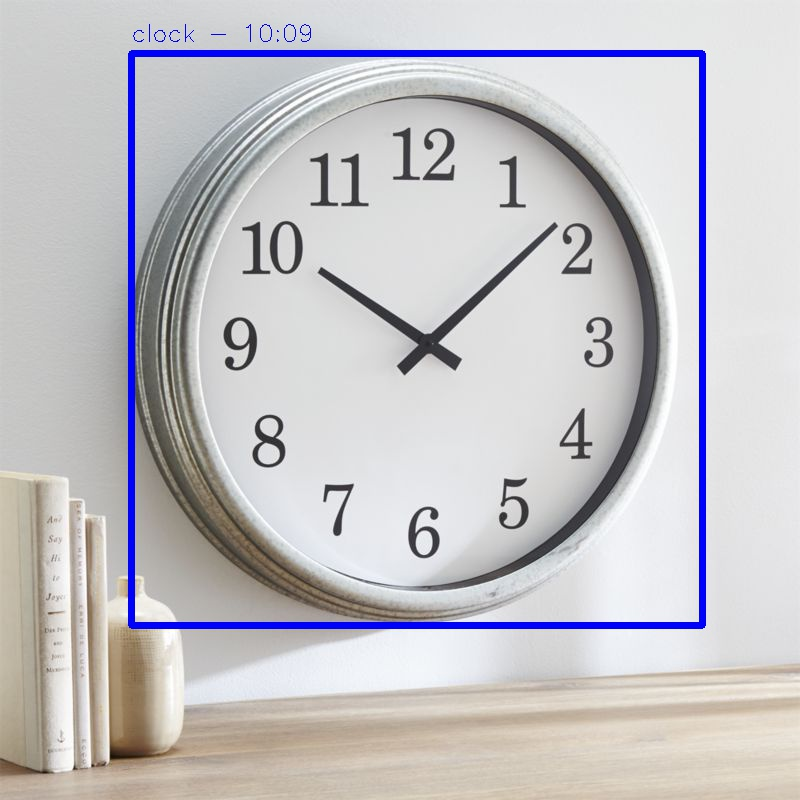

## SOFT 2017

Zadatak projekta: Real-time prepoznavanje analognih satova i učitavanje vremena sa njih



## Podešavanje okruženja

Nakon kloniranja repozitorijuma potrebno je u Conda terminalu locirati se na datoteku gde
je preuzet kod i uneti sledeće komande (podešavamo okruženje i dependancy-je):

    conda create -n NAZIV_OKRUŽENJA python=3.6
    
    activate NAZIV_OKRUŽENJA
    
    conda install tensorflow
    
    conda install cython 
    
    conda install numpy
    
    conda config --add channels conda-forge
    
    conda install opencv

## Korišćenje programa

U istom Conda terminalu možemo uneti sledeće komande za date funkcionalnosti:

1. Obrada video snimka:
    ```
    python flow --pbLoad built_graph/tiny-yolo-voc-clock.pb --metaLoad built_graph/tiny-yolo-voc-clock.meta
    --demo sample_img/video.mp4 --saveVideo
    ```
2. Obrada set-a slika:
    ```
    python flow --imgdir sample_img/ --pbLoad built_graph/tiny-yolo-voc-clock.pb --metaLoad 
    built_graph/tiny-yolo-voc-clock.meta
    ```
3. Obučavanje neuronske mreže (program sam pravi checkpiont-e):
    ```
    python flow --model cfg/tiny-yolo-voc-clock.cfg --load bin/tiny-yolo-voc.weights --train 
    --annotation test/training/annotations --dataset test/training/images
    ```
    
4. Čuvanje obučenih podataka na disk, u .pb datoteku (CH_NUM predstavlja redni broj checkpoint-a):
    ```
    python flow --model cfg/tiny-yolo-voc-clock.cfg --load CH_NUM --train --annotation 
    test/training/annotations --dataset test/training/images --savepb
    ```
    
5. Na svaku od prve 4 komande možemo dodati datu liniju, kako bismo izvršavali funkcionalnost
   na GPU umesto na CPU (ukoliko je instalirana cela podrška):
    ```
    --gpuName "/gpu:0" -- gpu 1.0	
    ```

## Dodatne informacije

Checkpointi za testiranje save opcije, kao i test i output video snimci nalaze se
u datom GoogleDrive folderu (zbog maksimalnog ograničenja veličine datoteke Git-a):
    ```
    [SOFT2017-GoogleDrive](https://drive.google.com/open?id=11Ss4yumVRkdsFjpX8G_yxRoIYwqhuczS)
    ```